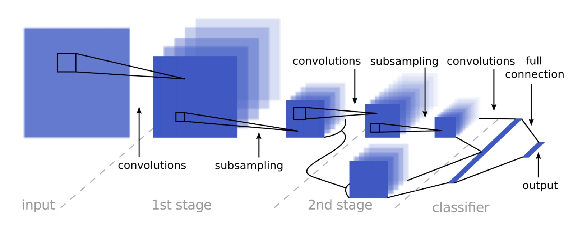

# **Traffic Sign Recognition Classifier**

---

**Build a Traffic Sign Recognition Classifier Project**

The goals: steps of this project are the following:
* Load the data set (see below for links to the project data set)
* Explore, summarize and visualize the data set
* Design, train and test a model architecture
* Use the model to make predictions on new images
* Analyze the softmax probabilities of the new images
* Summarize the results with a written report

## Rubric Points
### Here I will consider the [rubric points] individually and describe how I addressed each point in my implementation.

---

## Step 1: Data Set Summary & Exploration

#### 1. Provide a basic summary of the data set and identify where in your code the summary was done. In the code, the analysis should be done using python, numpy and/or pandas methods rather than hardcoding results manually.

The code for this step is contained in the [2] code cell of the IPython notebook.

using `numpy` library I have calculate summary statistics of the traffic
signs data set:

* The size of training set is 34799.
* The size of validation set is 4410
* The size of test set is 12630.
* The shape of a traffic sign image is (32, 32, 3).
* The number of unique classes/labels in the data set is 43.

#### 2. Include an exploratory visualization of the dataset and identify where the code is in your code file.

The code for this step is contained in cell [3] [4] and [5] code cells of the IPython notebook.

1-	An exploratory visualization of the data set. It is a bar chart showing the number of every traffic sign in training set.
2-	Number of Training Examples by Class and the labels of each class
3-	Show the images related to the class label

#### 3. Pre-process1: Grayscale

The code for this step is contained in the [6] code cells of the IPython notebook.

As a first step, I decided to convert the images to grayscale because
1-  This worked well for Sermanet and LeCun as described in their traffic sign classification article.
2-  It also helps to reduce training time, which was nice when a GPU wasn't available.

#### 4. Pre-process2: Normalization

The code for this step is contained in the [7] code cells of the IPython notebook.

Normalizing the data to the range (-1,1) 

* This was done using the line of code X_train_normalized = (X_train - 128)/128.
* The resulting dataset mean wasn't exactly zero, but it was reduced from around 82 to roughly -0.35.
* I chose to do this mostly because it was suggested in the lessons and it was fairly easy to do.
* How it helps is a bit nebulous to me, but [this site](https://stats.stackexchange.com/questions/185853/why-do-we-need-to-normalize-the-images-before-we-put-them-into-cnn) has an explanation, the gist of which is that having a wider distribution in the data would make it more difficult to train using a singlar learning rate. Different features could encompass far different ranges and a single learning rate might make some weights diverge.

Here is an example of a traffic sign image before and after Preprocessing.

#### 5. Modified LeNet Model Architecture

The code for the final model is located in cell [11] and cell[12] cells of the ipython notebook.

I began by implementing the same architecture from the LeNet Lab, with no changes since my dataset is in grayscale. This model worked quite well to begin with (~89% validation accuracy), but I also implemented the Sermanet/LeCun model from their traffic sign classifier paper and saw an immediate improvement. Although the paper doesn't go into detail describing exactly how the model is implemented (particularly the depth of the layers) I was able to make it work. The layers are set up like this:

1- 5x5 convolution (32x32x1 in, 28x28x6 out)
2- ReLU
3- 2x2 max pool (28x28x6 in, 14x14x6 out)
4- 5x5 convolution (14x14x6 in, 10x10x16 out)
5- ReLU
6- 2x2 max pool (10x10x16 in, 5x5x16 out)
7- 5x5 convolution (5x5x6 in, 1x1x400 out)
8- ReLu
9- Flatten layers from numbers 8 (1x1x400 -> 400) and 6 (5x5x16 -> 400)
10- Concatenate flattened layers to a single size-800 layer
11- Dropout layer
12- Fully connected layer (800 in, 43 out)

#### 6. Train, Validate and Test the Model

The code for training the model is located in cell [12] of the ipython notebook.

I used the Adam optimizer (already implemented in the LeNet lab). The final settings used were:

* batch size: 100
* epochs: 60
* learning rate: 0.0009
* mu: 0
* sigma: 0.1
* dropout keep probability: 0.5

My final model results were:

* training set accuracy of 1.000
* validation set accuracy of 0.934
* test set accuracy of 0.929
To get a good level of validation accuracy,I changed alot the hyperparameters 

I used an iterative approach to build up this model.

My approach was a little of both. Like I mentioned earlier, I started with pre-defined architectures (LeNet and the Sermanet/LeCun model) and almost all of the tweaking from there was a process of trial and error. Thankfully, my guesses were educated thanks to working through the Tensorflow and LeNet labs. I had also worked through the exercises for the Udacity Deep Learning course, and it was at that time that I discovered that trial and error is pretty much a losing strategy when it comes to building the neural net. I kept a log of my experiments, above, that shows how I played with hyperparameters to get a good level of validation accuracy.

#### Step 3: Test a Model on New Images

Nothing in particular sticks out that I think would make classification difficult. My images appear to be more easily distinguishable than quite a few images from the original dataset. I noticed that my images tend to be quite a bit brighter and might occupy a different range in the color space, possibly a range that the model was not trained on. In addition, the GTSRB dataset states that the images "contain a border of 10 % around the actual traffic sign (at least 5 pixels) to allow for edge-based approaches" and the images that I used do not all include such a border. This could be another source of confusion for the model.

The model appears to have predicted the new signs perfectly, with 100% accuracy - even better than the 93.9% validation accuracy and the 92.9% test accuracy. This is a good sign that the model performs well on real-world data. And while it's reasonable to assume that the accuracy would not remain so high given more data points, judging by the low fidelity of a number of images in the training dataset it's also reasonable to assume that if the real-world data were all as easily distinguishable as the eight images chosen that the accuracy would remain very high.

